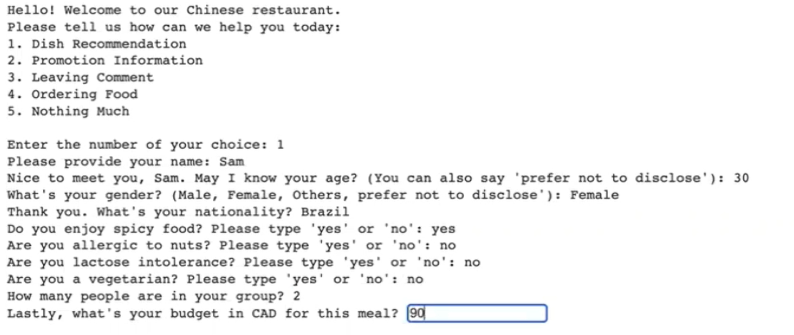
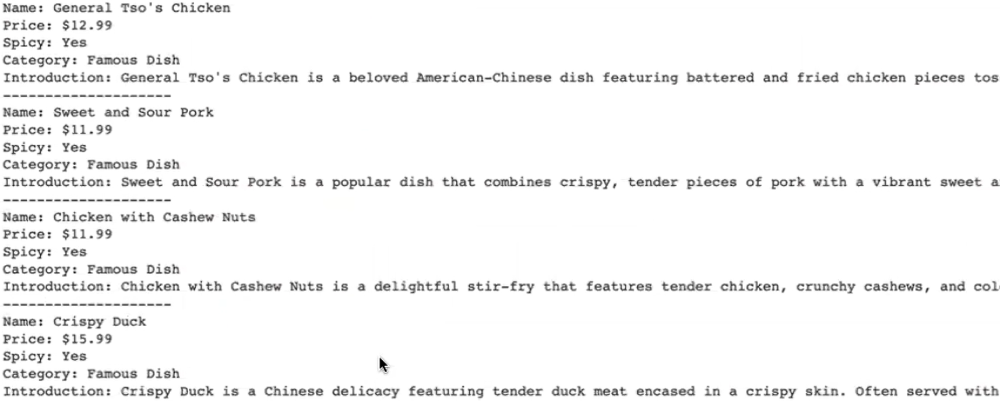
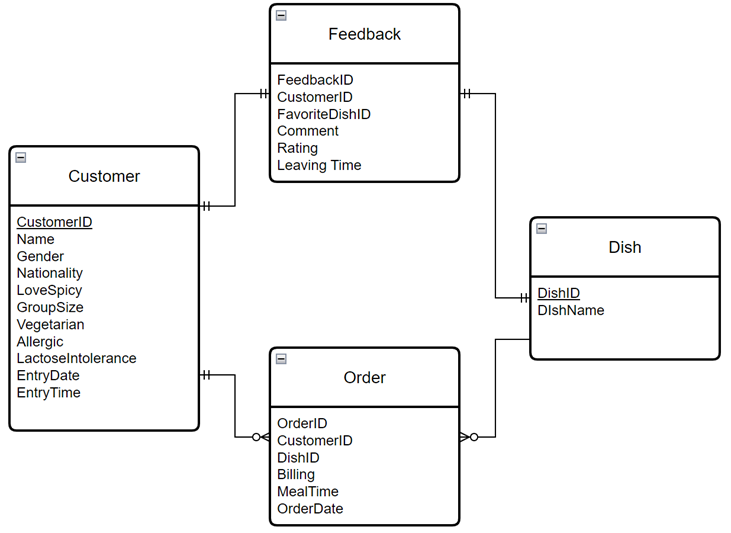
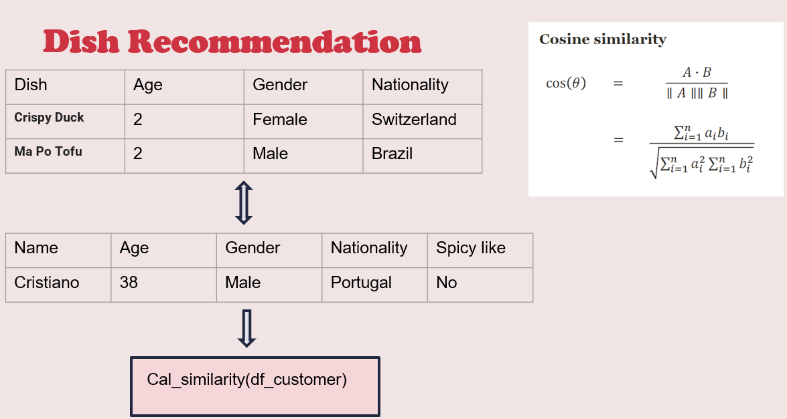

# Chatbot-for-Chinese-Dish-Recommendation

# Chinese Dish Recommendation Chatbot

## Demo Overview

This chatbot helps recommend Chinese dishes based on user preferences. In the demo, users provide details such as age, gender, nationality, and preferences like love for spicy food or any dietary restrictions. The chatbot then uses this information to recommend dishes from a predefined menu, which includes options such as General Tso's Chicken, Sweet and Sour Pork, Chicken with Cashew Nuts, and more.

Below are some screenshots from the demo:

## User Data Collection

Initially, we aimed to collect user interaction data, such as visits, scroll, and clicks, using Google Analytics. However, due to practicality issues, we decided to abandon Google Analytics as our data source. Instead, we created a mock dataset for testing and demo purposes to simulate real user interactions. Below is an illustration of the database we built for this project:

## Cosine Similarity Explanation

To calculate dish recommendations, we implemented a cosine similarity algorithm. This algorithm compares the user's input (age, gender, nationality, and preferences) to the available dish data and calculates the similarity to recommend the best dish. Below is the diagram from our presentation that illustrates this process:

## Conclusion

This project demonstrates a basic implementation of a Chinese dish recommendation system using a chatbot. By leveraging user input and cosine similarity, the system can provide tailored dish recommendations. We also explored and tested data collection methods before settling on a mock dataset for the demo.

